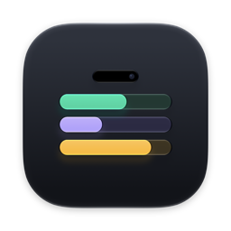
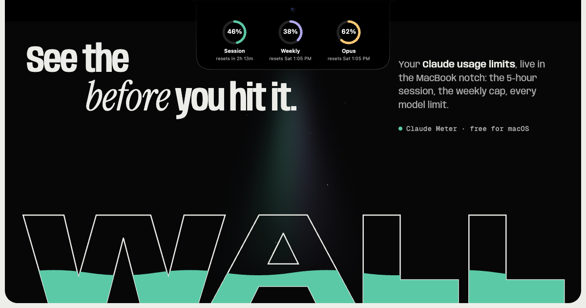

<p align="center"></p>

<h1 align="center">Claude Meter</h1>

<p align="center">Your Claude usage limits, live in the MacBook notch.<br>
<a href="https://claudemeter.vercel.app"><b>Download for Mac</b></a> · free · macOS 14.4+ · Apple Silicon & Intel</p>

<p align="center"></p>

Claude Meter turns the camera notch into a Dynamic-Island-style panel for your Claude subscription:
the 5-hour session, the weekly cap, and every per-model limit your account reports — so you see the
wall before you hit it.

- **Collapsed** — session and weekly hug the notch by default; right-click → Show limits for any mix of session, weekly and the model limit (e.g. Fable).
- **Hover** — the panel peeks open: three rings, reset countdowns, and a session forecast ("hits the cap in 1h 12m").
- **Click** — pin the full table with 6-hour sparklines. Right-click for settings.
- **Alerts** (opt-in) at 50/80/95% of a session and 80/95% of weekly and model limits.
- **Three looks** — Solid, Frosted, Liquid Glass. Works on Macs without a notch (a pill + optional menu-bar item) and hides in full-screen apps.

## Requirements

Claude Code installed and signed in with a Claude **Pro or Max** plan. API-key (Console) logins and a
custom `CLAUDE_CONFIG_DIR` aren't supported.

## Privacy

Claude Meter reads the sign-in Claude Code already saved on your Mac (Keychain item
`Claude Code-credentials` via Apple's `security` tool, falling back to `~/.claude/.credentials.json`).
When it renews an expired token it saves the new sign-in back there, the way Claude Code does, so the
terminal `claude` stays signed in; it writes nothing else. It talks to
`api.anthropic.com` (usage), `platform.claude.com` (token refresh) and, once a day, this project's
site for `version.json`. No analytics, no account, no server.

## Build from source

```bash
./build.sh            # universal app in build/, ad-hoc signed
./build.sh dmg        # + dist/ClaudeMeter.dmg
./build.sh release    # Developer ID signed, notarized + stapled (maintainer only)
.build/release/ClaudeMeter --selftest            # unit checks
.build/release/ClaudeMeter --snapshot ./snaps    # render every UI state to PNG
```

Needs Xcode 26+ (for `actool` and the Liquid Glass icon). The website lives in `site/` (static, built
from `web/` with `node web/build.mjs`).

## Star it

If Claude Meter saved you from a mid-task lockout, a ⭐ helps other people find it.

---

Independent project. Not affiliated with or endorsed by Anthropic. Claude is a trademark of Anthropic, PBC.
MIT licensed.
